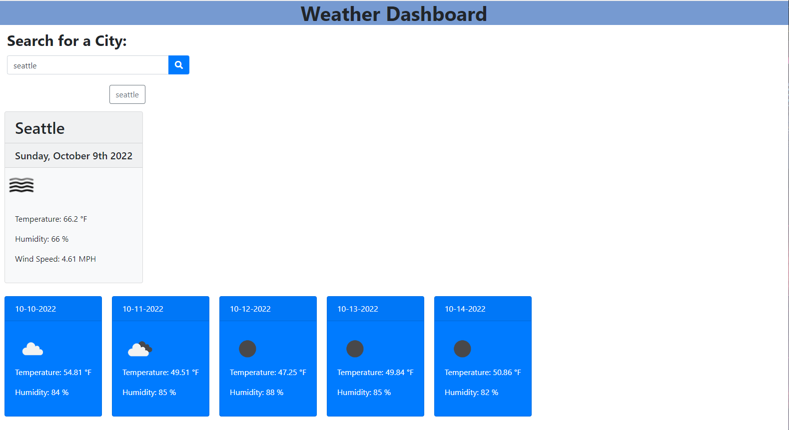

# Weather-Dashboard
This is a weather Dashboard constructed using HTML, CSS, and Javascript.
Outside libraries such as bootstrap, moment.js, and font awesome are used.
This project emphasizes the use of API keys, local storage, and buttons.
Here is the web applications appearance and functionality:

This is the link to the deployed application:
https://codejeffk.github.io/Weather-Dashboard/
